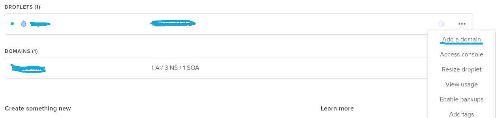
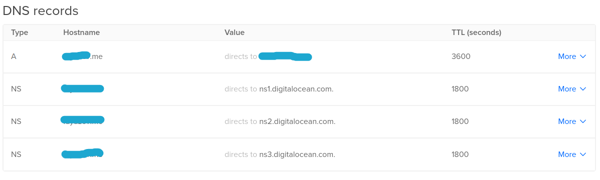

# Buying a domain & mapping it to our server

You can simply go ahead and buy a domain from any provider out there. Next thing is we should map it to our server.

### Mapping domain to DigitalOcean server/droplet

For digitalocean, in the dashboard you can find an option to `Add domain` there as below screenshot. For other hosting providers, do check the dashboard you'll find those options.

> Note on DNS records:
> A Record - Maps name to IP address
> CNAME - Maps name to name  
> Example:
> blog.prudhvi.me -> CNAME prudhvi.me
> prudhvi.me -> A 127.0.0.1

#### Things to be done at DigitalOcean or hosting provider dashboard (domain's dashboard)

1. create A record with www.domain to ip
2. create A record with domain to ip

Example:
| Record type | Domain name | Maps to |
|:--------------:|:-----------------:|:----------:|
| A | prudhvi.me | 127.0.0.1 |
| A | www.prudhvi.me | 127.0.0.1 |

3. Map domain to nameservers, example : ns1.digitalocean.com. Usually these records will be automatically generated by the provider, just as below
   

#### Now configuration on domain side.

1. Go to domain dashboard, go with custom DNS
2. Add `A` type record and map IP Address of the server to your domain
3. Add nameservers of the hosting providers with `NS` record type
   for digitalocean they would be ns1.digitalocean.com and so on.

---

Previous step - [Creating and storing SSH Keys](ssh_config.md) &nbsp;&nbsp;&nbsp;&nbsp;&nbsp;&nbsp;&nbsp;&nbsp;&nbsp; Next step - [Server setup](server_setup.md)
