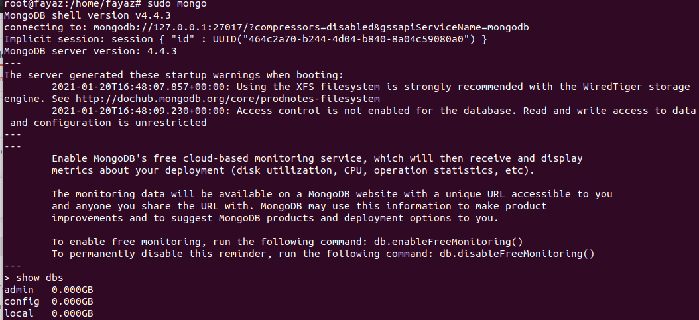

# MongoDB setup

Go ahead to [MongoDB](https://docs.mongodb.com/manual/installation/)'s official installation docs page and install it.

#### Start MongoDB service

For linux/mac:

```bash
sudo systemctl start mongod
```

Here we need to do three things

1. Create a `superuser` for mongodb authentication, first login as root user

```bash
$ sudo mongo
$ show dbs
```

The above command might show something similar to this


Now go ahead and add a `superuser`

```
$ use admin
$ db.createUser(
  {
    user: "superuser",
    pwd: "PlaceSecurePasswordHere",
    roles: [ { role: "userAdminAnyDatabase", db: "admin" }, "readWriteAnyDatabase" ]
  }
)
```

Once you've successfully added the `superuser`, proceed to the next step.

2. Enable `authorization` in mongodb configuration file
   Open the configuration file

```bash
$ vi /etc/mongod.conf
```

Search for security section and uncomment the line and add `authorization: enabled` under it or copy paste the below text

```bash
security:
  authorization: enabled
```

Restart the MongoDB server

```bash
$ systemctl restart mongod
```

3. Login as `superuser` now and add an `application` user for your API

```bash
$ mongo --authenticationDatabase "admin" -u "superuser"
```

It will ask for `password` enter and continue,

```bash
$ use admin
$ db.createUser(
  {
    user: "app",
    pwd:  "your-app-password",
    roles: [ { role: "readWrite", db: "db-name" } ]
  }
)
```

You can use the `application` user in REST API server.

---

Previous step - [Server setup](server_setup.md) &nbsp;&nbsp;&nbsp;&nbsp;&nbsp;&nbsp;&nbsp;&nbsp;&nbsp; Next step - [Nginx setup](nginx_setup.md)
