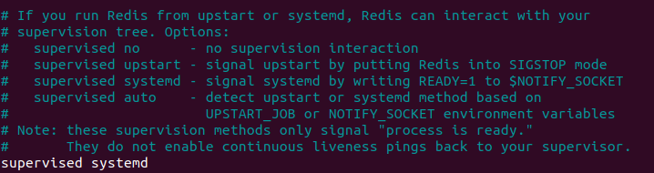

# Installing & configuring redis

1. Install redis-server

```bash
$ sudo apt install redis-server

```

2. Configure redis by adding to system deamon when system restarts this will come online
   `supervised systemd`

```bash
$ sudo vi /etc/redis/redis.conf
```



```bash
$ sudo systemctl restart redis
```

3. Check status

```bash
$ sudo systemctl status redis
```

4. Access CLI

```bash
$ redis-cli
```

---

Previous step - [Nginx setup](nginx_setup.md) &nbsp;&nbsp;&nbsp;&nbsp;&nbsp;&nbsp;&nbsp;&nbsp;&nbsp; Next step - [Redis setup](redis_setup.md)
