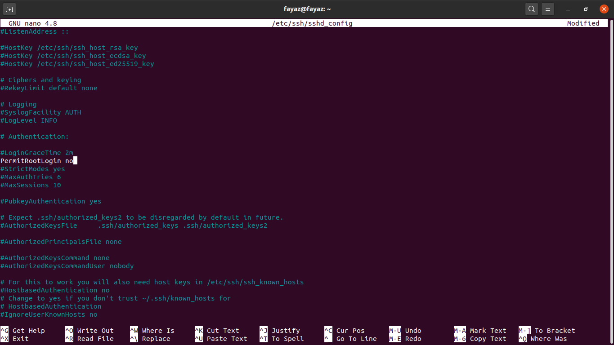

# Server setup

1. Update dependencies

```bash
$ apt update
$ apt upgrade
```

2. Create new user, enter all the required details, remember the password that will be used in future.

```bash
$ adduser <USERNAME>
```

3. Provide root access to user

```bash
$ usermod -aG sudo <USERNAME>
```

4. Switch to the new user

```bash
$ su <USERNAME>
```

3. Add the public key (SSH-key), that you've generated in step [Creating and storing SSH Keys](ssh_config.md). The below commands will open an editor, just paste the public key there, save it and close it. It's important that you are adding as user (new user) and not as root

```bash
$ cd ~
$ mkdir -p ~/.ssh
$ vi ~/.ssh/authorized_keys
```

4. Leave the server

```bash
$ exit - to exit from user
$ exit = to exit from root
```

5. Check log of users (Optional)

```bash
$ cat /var/log/auth.log - to check the log of users
$ tail -f /var/log/auth.log - to monitor the file output
```

6. Login with new username (don't login as root here)

```bash
$ ssh <USERNAME>@IP_ADDRESS
```

7. Turning of `root` login.

```bash
$ chmod 644 ~/.ssh/authorized_keys
$ sudo vi /etc/ssh/sshd_config
```

Here you'll see a config file, you just need to set `PermitRootLogin no`


8. Restart ssh service

```bash
$ sudo service sshd restart
```

---

Previous step - [Buying a domain and mapping it to our server](domain_mapping.md) &nbsp;&nbsp;&nbsp;&nbsp;&nbsp;&nbsp;&nbsp;&nbsp;&nbsp; Next step - [MongoDB setup](mongo_setup.md)
