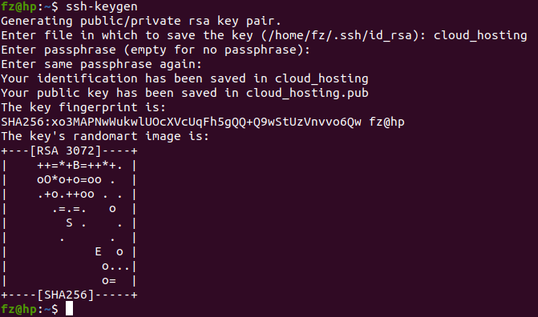
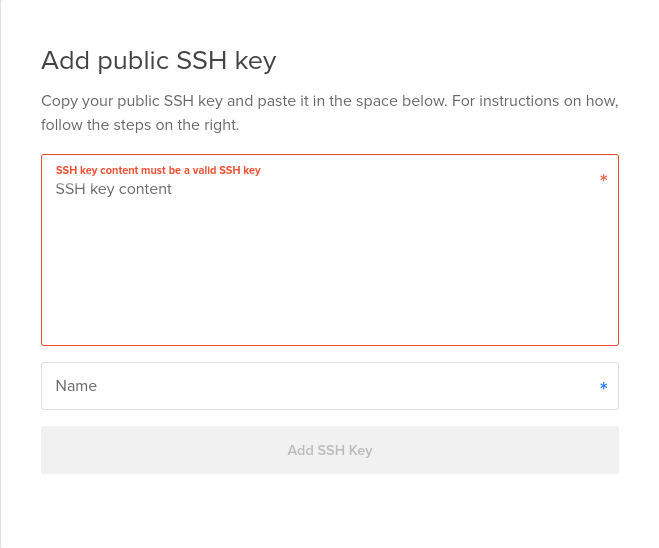
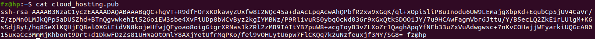

### 1. Creating and storing SSH keys

#### What is this?

SSH (Secure Shell) keys are an access credential that is used in the SSH protocol.

#### Why we should do this?

In a user key set, the private key remains on the system being used to access the remote system and is used to decrypt information that is exchanged in the SSH protocol. Private keys should never be shared with anyone. A public key is used to encrypt information, can be shared, and is used by the user and the [remote server](https://jumpcloud.com/blog/remote-machine-management/).

#### Setup part

1.  Create ssh key in your local system, enter filename and passwords

```bash
$ cd ~/.ssh
$ ssh-keygen
```


Now our key is created.

2.  If you're creating a droplet in **DigitalOcean**, then you'll see something like below. Go ahead and paste the **public** key there. You'll get the output of the public key by executing below code.
    

```bash
$ cat cloud_hosting.pub
```



3. Let's go ahead and connect to our server, default user will be **root**, replace the `IP_ADDRESS` with your server's IP

```bash
$ ssh root@IP_ADDRESS
```

This would fail because we didn't mention the credentials to connect to the server securely. Let's go ahead and use the **private key** that we generated in previous step to connect to the server. It would ask password, enter the password that you've used in previous step.

```bash
$ ssh -i ~/.ssh/private_key root@IP_ADDRESS
```

4. This works, but we don't have to specify the private key and enter the complex password everytime. Let's go ahead and store the key in our local machine ssh config. Use your favourite text editor and get started.

```bash
$ vi ~/.ssh/config
```

After opening the editor, paste the below configuration, save it and close it.

```bash
Host *
  AddKeysToAgent yes
  UseKeychain yes
```

if you encounter any issue something like below while connecting to server after this step, then update the config as follows

```bash
$ /home/user/.ssh/config: line 3: Bad configuration option: usekeychain
$ /home/user/.ssh/config: terminating, 1 bad configuration options
```

```bash
Host *
  IgnoreUnknown AddKeysToAgent,UseKeychain
  AddKeysToAgent yes
  UseKeychain yes
```

5. Add our keys to `ssh config`

```bash
$ ssh-add -K ~/.ssh/fsfe
```

6. Connect to the server

```bash
$ ssh root@IP_ADDRESS
```

---

Next step - [Buying a domain and mapping it to our server](domain_mapping.md)
